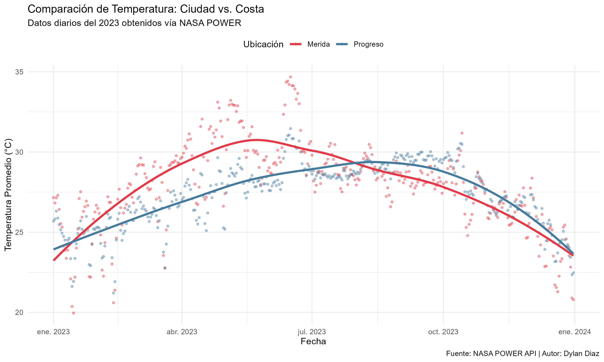

# 🌦️ Análisis de Clima en Yucatán: Efecto Termorregulador

### 📋 Descripción
Este proyecto automatiza la descarga y análisis de datos meteorológicos históricos utilizando la API de **NASA POWER**. Compara las temperaturas de **Mérida (Urbano)** vs. **Progreso (Costa)** para visualizar el impacto del océano en la temperatura.

### 🛠️ Tecnologías
* **R & RStudio**
* **Librerías:** `nasapower` (API), `tidyverse` (ETL), `ggplot2` (Visualización).
* **Automatización:** Uso de `purrr` para iterar sobre múltiples coordenadas geográficas.

### 📊 Resultados (2023)

---
*Autor: Dylan Diaz*